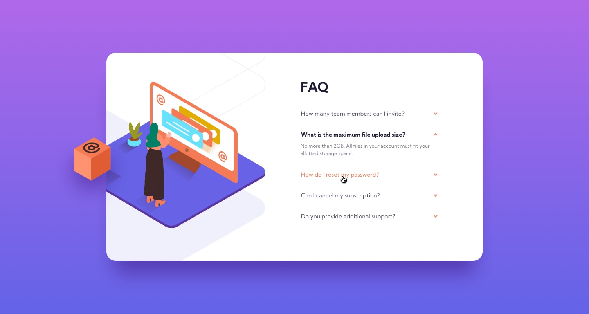

# FAQ-Accordion
Nice challenge with Frontend Mentor - see the final result here: https://foxdesign-ie.github.io/FAQ-Accordion/

-----------------------------------------
# Brief:
The challenge is to build out this FAQ accordion card and get it looking as close to the design as possible.

Users should be able to:

- View the optimal layout for the component depending on their device's screen size
- See hover states for all interactive elements on the page
- Hide/Show the answer to a question when the question is clicked

------------------------------------------

